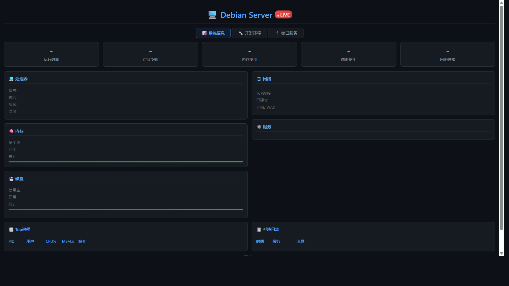

# XTerminal - Linux 系统状态监控面板

轻量级 Linux 系统实时监控 Web 面板，Go 单文件实现，内嵌前端，零依赖部署。

## 功能

- **📊 系统信息** - CPU、内存、磁盘、运行时间
- **🌐 网络** - 网卡状态、IP、流量、TCP 连接
- **📈 进程** - Top 10 进程列表
- **📋 日志** - 系统日志实时展示
- **🔌 端口** - 监听端口及服务类型识别（system/docker/go/python/node/java 等）
- **🔧 开发环境** - 自动检测 GCC、Make、Python、Node、Go、Java、Docker 等版本
- **⚙️ 服务状态** - Docker、Nginx、Redis、PostgreSQL 等服务运行状态

## 截图



## 快速部署

```bash
# 编译
go build -o server_monitor server_monitor.go

# 运行（监听 :8080）
./server_monitor

# 访问
http://your-server:8080
```

## API

- `GET /` - 监控面板页面
- `GET /api` - 系统信息 JSON 接口

## 技术栈

- **后端**: Go (net/http)
- **前端**: 原生 HTML + CSS + JavaScript（内嵌）
- **刷新**: 每 3 秒自动刷新

## 版本

v18
