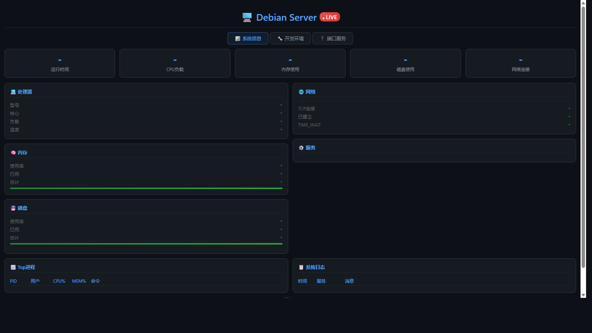

# XTerminal

Linux 系统状态监控面板。项目使用一个 Go 文件和内嵌前端展示 CPU、内存、磁盘、网络、进程、监听端口、服务状态、工具版本及近期系统日志。



## 环境要求

- Linux `/proc` 和 `/sys` 文件系统
- 编译时使用 Go 1.22+
- `ip`、`ss`、`ps`、`systemctl`、`journalctl` 等系统命令；命令缺失时对应字段可能为空

## 编译与运行

```bash
git clone https://github.com/LceAn/xterminal.git
cd xterminal
go build -o xterminal .
./xterminal
```

默认仅监听 `127.0.0.1:8080`。可显式修改地址：

```bash
./xterminal --host 0.0.0.0 --port 9000
```

开放到非本机地址前，应配置防火墙、反向代理、HTTPS 和访问认证。`GET /api` 会返回进程、端口、服务和系统日志信息，不适合直接暴露在公网。

## 接口

| 路径 | 方法 | 说明 |
| --- | --- | --- |
| `/` | `GET`, `HEAD` | 监控页面 |
| `/api` | `GET` | 当前系统状态 JSON，响应禁止缓存 |

未知路径返回 `404`，不支持的方法返回 `405`。HTTP 服务配置了请求头、读写和空闲超时。

## systemd 示例

```ini
[Unit]
Description=XTerminal system monitor
After=network.target

[Service]
Type=simple
ExecStart=/opt/xterminal/xterminal --host 127.0.0.1 --port 8080
Restart=on-failure
RestartSec=5
NoNewPrivileges=true

[Install]
WantedBy=multi-user.target
```

## 开发验证

```bash
gofmt -w server_monitor.go server_monitor_test.go
go test ./...
go vet ./...
```

GitHub Actions 会验证监听参数、API 响应、未知路由和方法限制。

## 许可

当前仓库没有 `LICENSE` 文件。README 历史版本曾标注 MIT，但在补充实际许可证文件前，不应据此再分发。

<!-- repo-readme-standard:v1 -->
## 仓库维护信息

- 项目类型：Linux 监控工具
- 当前状态：维护中
- 可见性：public
- 维护节奏：按月检查 Linux 命令兼容性和信息暴露边界
- 相关仓库：未发现功能相同、可直接合并的仓库
- 维护边界：归档、删除、历史重写或强制推送需单独确认

---

## 文档

- [CHANGELOG.md](CHANGELOG.md) — 更新日志
- [ROADMAP.md](ROADMAP.md) — 未来更新计划
